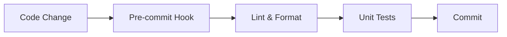
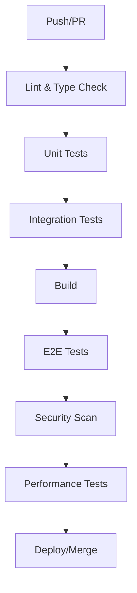

# PilotBA Testing Strategy

## Executive Summary

This document outlines the comprehensive testing strategy for PilotBA, a high-performance business intelligence platform. Our approach ensures quality, reliability, and security through multiple testing layers.

## Goals & Objectives

### Primary Goals
1. **Quality Assurance**: Catch bugs before production
2. **Regression Prevention**: Ensure new code doesn't break existing functionality
3. **Performance Validation**: Maintain sub-500ms API response times
4. **Security Compliance**: Zero tolerance for HIGH/CRITICAL vulnerabilities
5. **Documentation**: Living documentation through tests

### Success Metrics

| Metric | Target | Current | Status |
|--------|--------|---------|--------|
| Code Coverage | 80% | TBD | 🟡 |
| Test Pass Rate | 100% | TBD | 🟡 |
| P95 Response Time | <500ms | TBD | 🟡 |
| Security Issues | 0 HIGH/CRITICAL | TBD | 🟡 |
| E2E Pass Rate | >95% | TBD | 🟡 |

## Testing Layers

### 1. Unit Tests (60% of tests)

**Scope**: Individual functions, methods, components

**Tools**:
- Backend: Rust `#[test]`, `rstest` for parameterized tests
- Frontend: Vitest, Testing Library

**Coverage Goals**:
- Business logic: 90%
- Utilities: 85%
- Components: 80%
- Configuration: 60%

**Example Areas**:
- Data models serialization/deserialization
- Utility functions (date formatting, calculations)
- React component rendering
- State management logic

### 2. Integration Tests (30% of tests)

**Scope**: Component interactions, API endpoints, database operations

**Tools**:
- Backend: Actix-test, testcontainers
- Frontend: MSW (Mock Service Worker)

**Coverage Goals**:
- All API endpoints
- Database CRUD operations
- Cache interactions
- External service integrations

**Example Areas**:
- REST API endpoints
- GraphQL resolvers
- WebSocket connections
- Redis caching
- Database queries

### 3. End-to-End Tests (10% of tests)

**Scope**: Complete user workflows

**Tools**:
- Playwright (multi-browser)
- Axe for accessibility

**Coverage Goals**:
- All critical user journeys
- Cross-browser compatibility
- Mobile responsiveness
- Accessibility compliance (WCAG 2.1 AA)

**Example Scenarios**:
- User authentication flow
- Dashboard creation and editing
- Data query execution
- Visualization rendering
- Export functionality

## Test Execution Strategy

### Development Phase



**Developer Workflow**:
1. Write code + tests
2. Run relevant unit tests locally
3. Pre-commit hook validates
4. Push to branch

### CI/CD Pipeline



**Pipeline Stages**:

1. **Fast Feedback** (< 5 min)
   - Linting
   - Type checking
   - Unit tests

2. **Integration** (5-10 min)
   - Integration tests with test DB
   - API contract tests

3. **End-to-End** (10-15 min)
   - Critical path E2E tests
   - Smoke tests

4. **Extended** (15-30 min, parallel)
   - Full E2E suite
   - Performance benchmarks
   - Security scans
   - Cross-browser tests

## Test Environment Strategy

### Local Development

```yaml
Environment: local-dev
Purpose: Developer testing
Data: Mock/fixtures
Services: Docker Compose
```

**Characteristics**:
- Fast feedback loop
- Isolated from other developers
- Uses test fixtures
- No external dependencies

### CI/CD Environment

```yaml
Environment: ci
Purpose: Automated testing
Data: Seed data
Services: GitHub Actions + containers
```

**Characteristics**:
- Fresh environment per run
- Reproducible
- Parallelizable
- Ephemeral

### Staging Environment

```yaml
Environment: staging
Purpose: Pre-production validation
Data: Production-like (anonymized)
Services: Production mirrors
```

**Characteristics**:
- Production parity
- Real integrations
- Performance testing
- UAT

## Performance Testing Strategy

### Backend Performance

**Approach**: Criterion benchmarks + k6 load tests

**Targets**:
- Query execution: < 100ms (p95)
- API response: < 500ms (p95)
- Throughput: > 1000 req/s
- Memory: < 512MB baseline

**Methodology**:
1. Baseline measurement
2. Load testing (ramp-up)
3. Stress testing (breaking point)
4. Soak testing (stability)

### Frontend Performance

**Approach**: Lighthouse CI + bundle analysis

**Targets**:
- FCP: < 1.8s
- LCP: < 2.5s
- TTI: < 3.8s
- CLS: < 0.1
- Bundle: < 5MB

**Methodology**:
1. Lighthouse scores (CI)
2. Bundle size tracking
3. Web Vitals monitoring
4. Real User Monitoring (RUM)

## Security Testing Strategy

### Static Analysis

**Tools**:
- cargo-audit (Rust)
- npm audit (JavaScript)
- CodeQL (SAST)
- Trivy (containers)

**Frequency**: Every PR + weekly scheduled

### Dynamic Analysis

**Approach**: OWASP Top 10 coverage

**Test Areas**:
1. **Injection**: SQL, NoSQL, Command
2. **Broken Authentication**: Session management, password policies
3. **Sensitive Data Exposure**: Encryption, secure transmission
4. **XML External Entities**: N/A (no XML processing)
5. **Broken Access Control**: Authorization, privilege escalation
6. **Security Misconfiguration**: Headers, CORS, CSP
7. **XSS**: Input sanitization, output encoding
8. **Insecure Deserialization**: JSON parsing, validation
9. **Components with Known Vulnerabilities**: Dependency scanning
10. **Insufficient Logging**: Audit trail, monitoring

**Methodology**:
1. Automated scans (CI)
2. Manual penetration testing (quarterly)
3. Security code reviews
4. Threat modeling sessions

## Regression Testing

### Approach

1. **Comprehensive Test Suite**: All tests act as regression tests
2. **CI/CD Enforcement**: No merge without passing tests
3. **Visual Regression**: Screenshot comparisons (future)
4. **API Contract Testing**: Schema validation

### Prevention Strategies

- Feature flags for gradual rollouts
- Canary deployments
- Monitoring & alerting
- Automated rollback on failures

## Test Data Management

### Strategy

1. **Fixtures**: Hardcoded test data for unit tests
2. **Factories**: Programmatic data generation
3. **Seed Data**: Consistent datasets for integration tests
4. **Anonymized Production Data**: Staging environment only

### Guidelines

```typescript
// ✅ GOOD: Use factories
const user = createTestUser({ email: 'specific@example.com' })

// ✅ GOOD: Use fixtures for consistency
import { MOCK_DASHBOARD } from '@/test/fixtures'

// ❌ BAD: Hardcoded values everywhere
const user = { id: 1, name: 'Test' }
```

## Accessibility Testing

### WCAG 2.1 Level AA Compliance

**Tools**:
- Axe Core (automated)
- Lighthouse (automated)
- Manual testing (screen readers)

**Test Areas**:
1. Keyboard navigation
2. Screen reader compatibility
3. Color contrast
4. Focus management
5. ARIA labels
6. Semantic HTML

**Frequency**: Every component, every PR

## Mobile Testing

### Strategy

**Approach**: Playwright device emulation + real device testing

**Devices Tested**:
- iPhone 12/13/14 (Safari)
- Pixel 5/6 (Chrome)
- iPad (Safari)
- Samsung Galaxy (Chrome)

**Test Scenarios**:
- Touch interactions
- Responsive layouts
- Performance on constrained devices
- Offline functionality

## Cross-Browser Testing

### Browser Matrix

| Browser | Versions | Priority |
|---------|----------|----------|
| Chrome | Latest + 1 | High |
| Firefox | Latest + 1 | High |
| Safari | Latest + 1 | Medium |
| Edge | Latest | Medium |
| Mobile Safari | Latest | High |
| Mobile Chrome | Latest | High |

### Execution

- **CI**: Chrome, Firefox, Safari (Playwright)
- **Manual**: Edge, older versions
- **Cloud**: BrowserStack for broader coverage

## Test Maintenance

### Review Frequency

- **Weekly**: Flaky test review
- **Monthly**: Coverage analysis
- **Quarterly**: Strategy review
- **Annually**: Major updates

### Cleanup Criteria

Remove tests that are:
- Consistently flaky (>5% failure rate)
- Testing implementation details
- Duplicating coverage
- Testing obsolete features

### Updating Tests

When refactoring:
1. Update tests alongside code
2. Don't skip tests to make PRs pass
3. If tests are hard to update, consider design
4. Add tests for new edge cases discovered

## Roles & Responsibilities

### Developers

- Write unit tests for all new code
- Maintain existing tests
- Run tests locally before pushing
- Fix failing tests promptly

### QA Engineers

- Design test strategies
- Write E2E tests
- Perform exploratory testing
- Maintain test infrastructure
- Review test coverage
- Security testing

### DevOps

- Maintain CI/CD pipelines
- Manage test environments
- Monitor test execution times
- Optimize test infrastructure

## Metrics & Reporting

### KPIs Tracked

1. **Test Coverage**: Lines/branches/functions
2. **Test Execution Time**: Per suite, per test
3. **Flaky Test Rate**: Tests that fail intermittently
4. **Mean Time to Detect (MTTD)**: Bug to test failure
5. **Mean Time to Resolve (MTTR)**: Failure to fix

### Dashboards

- **CI/CD Dashboard**: Build status, trends
- **Coverage Dashboard**: Coverage trends, gaps
- **Performance Dashboard**: Benchmark results over time
- **Security Dashboard**: Vulnerability tracking

## Risk Management

### High-Risk Areas

1. **Data Pipeline**: Query execution, transformations
2. **Authentication**: User sessions, permissions
3. **Visualization**: Performance, accuracy
4. **Real-time Features**: WebSocket stability
5. **Data Export**: Security, integrity

### Mitigation Strategies

- **Extra Test Coverage**: 95%+ for high-risk areas
- **Chaos Engineering**: Deliberate failure injection
- **Canary Deployments**: Gradual rollouts
- **Feature Flags**: Quick disable capability

## Continuous Improvement

### Retrospectives

**Frequency**: After each major release

**Topics**:
- What testing gaps were found?
- Which tests provided most value?
- What slowed us down?
- How can we improve?

### Experimentation

- Try new testing tools
- Implement test automation ideas
- Measure impact
- Adopt or discard

## Conclusion

This testing strategy balances thoroughness with pragmatism, ensuring high quality while maintaining developer velocity. It will evolve as the project grows and we learn what works best for PilotBA.

---

**Version**: 1.0.0  
**Last Updated**: December 2025  
**Next Review**: March 2026  
**Owner**: QA Team

